<?xml version="1.0" encoding="UTF-8"?>
<!DOCTYPE html PUBLIC "-//W3C//DTD XHTML 1.1 plus MathML 2.0//EN"
        "HTMLFiles/xhtml-math11-f.dtd">

<!-- Created with the Wolfram Language : www.wolfram.com -->

<html xmlns="http://www.w3.org/1999/xhtml">
<head>
 <title>
  CVHW5
 </title>
 <link href="HTMLFiles/CVHW5.css" rel="stylesheet" type="text/css" />
</head>

<body>

 The 5th homework.

 No.2160508170

 Image Preprocessing

 Import the images

 

<table class='Output'>
 <tr style='vertical-align: baseline;'>
  <td style='text-align: center;'>Test image 0</td>
  <td style='text-align: center;'>Test image 1</td>
 </tr>
 <tr style='vertical-align: baseline;'>
  <td style='text-align: center;'></td>
  <td style='text-align: center;'></td>
 </tr>
</table>

 Scale the input pictures to 256*256; Pad them into 512*512; Centralize the spectrum.

 The centralization of the spectrum is performed by multiplying  pixel by pixel. Proof:

 

 

 

<table class='Output'>
 <tr style='vertical-align: baseline;'>
  <td style='text-align: center;'>Preprocessing Result</td>
  <td style='text-align: center;'></td>
 </tr>
 <tr style='vertical-align: baseline;'>
  <td style='text-align: center;'>Image0</td>
  <td style='text-align: center;'>Image1</td>
 </tr>
 <tr style='vertical-align: baseline;'>
  <td style='text-align: center;'></td>
  <td style='text-align: center;'></td>
 </tr>
</table>

 The Fourier Spectrum before Processing:

 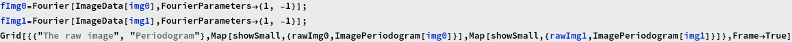

<table class='Output' frame='box'>
 <tr style='vertical-align: baseline;'>
  <td style='text-align: center;'>The raw image</td>
  <td style='text-align: center;'>Periodogram</td>
 </tr>
 <tr style='vertical-align: baseline;'>
  <td style='text-align: center;'></td>
  <td style='text-align: center;'></td>
 </tr>
 <tr style='vertical-align: baseline;'>
  <td style='text-align: center;'></td>
  <td style='text-align: center;'></td>
 </tr>
</table>

 Butterworth LPF

 Butterworth filter is type of FIR filter designed to have a frequency response as flat as possible in the passband. The frequency response of the Butterworth LPF is:

 

 To solve the exact transfer function of the filter, we rewrite the G(&omega;) into . Noting that the polarization must lie in the region where Re{s} &lt; 0, the H(&omega;) can be solved Engineers suffers to calculate the transfer function again and again and some of them summerize the standardized function and make a table. 

 

<table class='Output' frame='box' rules='all'>
 <tr style='vertical-align: baseline;'>
  <td style='text-align: center;'>1</td>
  <td style='text-align: center;'></td>
 </tr>
 <tr style='vertical-align: baseline;'>
  <td style='text-align: center;'>2</td>
  <td style='text-align: center;'></td>
 </tr>
 <tr style='vertical-align: baseline;'>
  <td style='text-align: center;'>3</td>
  <td style='text-align: center;'>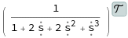</td>
 </tr>
 <tr style='vertical-align: baseline;'>
  <td style='text-align: center;'>4</td>
  <td style='text-align: center;'></td>
 </tr>
 <tr style='vertical-align: baseline;'>
  <td style='text-align: center;'>5</td>
  <td style='text-align: center;'></td>
 </tr>
</table>

 Substituting the &omega; into  yields the 2D Butterworth LPF.

 

 Generate Butterworth 1D Low-pass Filters

  It&rsquo;s not a wise choice to copy the formula from the test book because it&rsquo;s simply wrong.  The author mistake the  and the ||H(&omega;)||, and yielding a wrong cutoff frequency.    We construct the LPF from the continuous version Butterworth LPF prototype and then convert the continuous LPF into discrete LPF. Thus, three parameters are to be determined: the cutoff frequency ,the order of the LPF n and the sampling interval &tau;.   The final cutoff frequency  in DFT is :

 

 The possible error lies in the sampling and DFT procedure. Frequency leakage result in the deviation of the cutoff frequency. The higher cutoff frequency, the higher error.

 

 

 

 

 

 Generate 2D Butterworth FIlter

 

 
<map name="map_34">
<area shape="rect" coords="0,14,20,0" title="Dynamic[RawBoxes[FEPrivate`FrontEndResource[FEStrings, messageMenuTooltip]]]" nohref="" />
</map>

<table class='Output'>
 <tr style='vertical-align: baseline;'>
  <td style='text-align: center;'></td>
  <td style='text-align: center;'>The 2D butterworth filter</td>
  <td style='text-align: center;'></td>
 </tr>
 <tr style='vertical-align: baseline;'>
  <td style='text-align: center;'>Periodogram</td>
  <td style='text-align: center;'>3D View</td>
  <td style='text-align: center;'>CounterPlot</td>
 </tr>
 <tr style='vertical-align: baseline;'>
  <td style='text-align: center;'></td>
  <td style='text-align: center;'></td>
  <td style='text-align: center;'>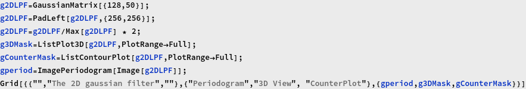
<map name="map_37">
<area shape="rect" coords="93,266,285,74" title="0.2" nohref="" />
<area shape="rect" coords="98,261,279,80" title="0.4" nohref="" />
<area shape="rect" coords="102,257,276,83" title="0.6" nohref="" />
<area shape="rect" coords="104,255,274,85" title="0.8" nohref="" />
<area shape="rect" coords="106,253,272,87" title="1" nohref="" />
<area shape="rect" coords="108,251,270,89" title="1.2" nohref="" />
<area shape="rect" coords="110,249,268,91" title="1.4" nohref="" />
<area shape="rect" coords="112,247,266,93" title="1.6" nohref="" />
<area shape="rect" coords="115,244,263,96" title="1.8" nohref="" />
<area shape="rect" coords="172,187,206,153" title="2" nohref="" />
</map></td>
 </tr>
</table>

 Gaussian LPF

 Generate the Gaussian Filter

 

<table class='Output'>
 <tr style='vertical-align: baseline;'>
  <td style='text-align: center;'></td>
  <td style='text-align: center;'>The 2D gaussian filter</td>
  <td style='text-align: center;'></td>
 </tr>
 <tr style='vertical-align: baseline;'>
  <td style='text-align: center;'>Periodogram</td>
  <td style='text-align: center;'>3D View</td>
  <td style='text-align: center;'>CounterPlot</td>
 </tr>
 <tr style='vertical-align: baseline;'>
  <td style='text-align: center;'></td>
  <td style='text-align: center;'>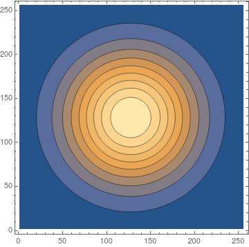</td>
  <td style='text-align: center;'>
<map name="map_41">
<area shape="rect" coords="49,310,328,31" title="0.2" nohref="" />
<area shape="rect" coords="72,287,306,53" title="0.4" nohref="" />
<area shape="rect" coords="87,272,291,68" title="0.6" nohref="" />
<area shape="rect" coords="100,259,278,81" title="0.8" nohref="" />
<area shape="rect" coords="111,248,267,92" title="1" nohref="" />
<area shape="rect" coords="121,238,256,103" title="1.2" nohref="" />
<area shape="rect" coords="132,227,246,113" title="1.4" nohref="" />
<area shape="rect" coords="143,216,234,125" title="1.6" nohref="" />
<area shape="rect" coords="156,203,221,138" title="1.8" nohref="" />
</map></td>
 </tr>
</table>

 LPF Filter Test

 

<table class='Output'>
 <tr style='vertical-align: baseline;'>
  <td style='text-align: center;'>Raw</td>
  <td style='text-align: center;'>Butterworth</td>
  <td style='text-align: center;'>Gaussian</td>
 </tr>
 <tr style='vertical-align: baseline;'>
  <td style='text-align: center;'></td>
  <td style='text-align: center;'></td>
  <td style='text-align: center;'></td>
 </tr>
 <tr style='vertical-align: baseline;'>
  <td style='text-align: center;'></td>
  <td style='text-align: center;'></td>
  <td style='text-align: center;'>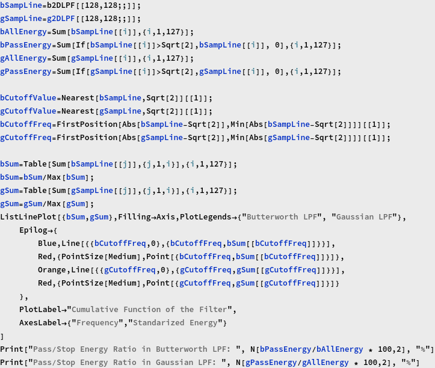</td>
 </tr>
</table>

 Butterworth HPF

 Generate Butterworth 1D Low-pass Filters

 

 

 

 

 

 Generate the 2D Butterworth HPF

 

 
<map name="map_55">
<area shape="rect" coords="0,14,20,0" title="Dynamic[RawBoxes[FEPrivate`FrontEndResource[FEStrings, messageMenuTooltip]]]" nohref="" />
</map>

<table class='Output'>
 <tr style='vertical-align: baseline;'>
  <td style='text-align: center;'></td>
  <td style='text-align: center;'>The 2D butterworth filter</td>
  <td style='text-align: center;'></td>
 </tr>
 <tr style='vertical-align: baseline;'>
  <td style='text-align: center;'>Periodogram</td>
  <td style='text-align: center;'>3D View</td>
  <td style='text-align: center;'>CounterPlot</td>
 </tr>
 <tr style='vertical-align: baseline;'>
  <td style='text-align: center;'>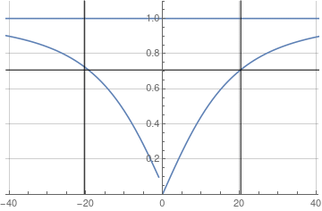</td>
  <td style='text-align: center;'>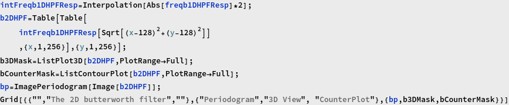</td>
  <td style='text-align: center;'>
<map name="map_58">
<area shape="rect" coords="184,175,193,166" title="0" nohref="" />
<area shape="rect" coords="181,178,197,162" title="0.25" nohref="" />
<area shape="rect" coords="178,181,200,159" title="0.5" nohref="" />
<area shape="rect" coords="174,185,204,155" title="0.75" nohref="" />
<area shape="rect" coords="169,190,208,151" title="1" nohref="" />
<area shape="rect" coords="164,195,214,145" title="1.25" nohref="" />
<area shape="rect" coords="155,204,222,137" title="1.5" nohref="" />
<area shape="rect" coords="138,221,239,120" title="1.75" nohref="" />
</map></td>
 </tr>
</table>

 Gaussian HPF.

 

<table class='Output'>
 <tr style='vertical-align: baseline;'>
  <td style='text-align: center;'></td>
  <td style='text-align: center;'>The 2D gaussian filter</td>
  <td style='text-align: center;'></td>
 </tr>
 <tr style='vertical-align: baseline;'>
  <td style='text-align: center;'>Periodogram</td>
  <td style='text-align: center;'>3D View</td>
  <td style='text-align: center;'>CounterPlot</td>
 </tr>
 <tr style='vertical-align: baseline;'>
  <td style='text-align: center;'>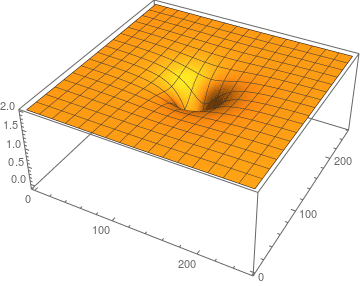</td>
  <td style='text-align: center;'>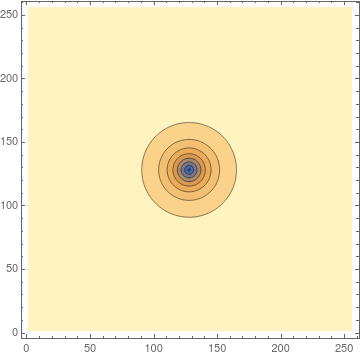</td>
  <td style='text-align: center;'>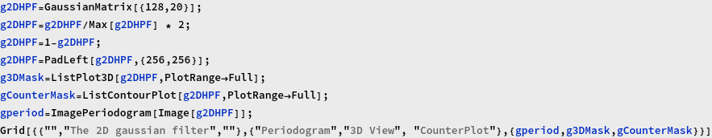
<map name="map_62">
<area shape="rect" coords="174,185,204,155" title="-0.8" nohref="" />
<area shape="rect" coords="169,190,209,150" title="-0.6" nohref="" />
<area shape="rect" coords="164,195,213,146" title="-0.4" nohref="" />
<area shape="rect" coords="160,199,218,141" title="-0.2" nohref="" />
<area shape="rect" coords="156,203,222,137" title="0" nohref="" />
<area shape="rect" coords="151,208,226,133" title="0.2" nohref="" />
<area shape="rect" coords="146,213,231,128" title="0.4" nohref="" />
<area shape="rect" coords="140,219,238,121" title="0.6" nohref="" />
<area shape="rect" coords="131,228,247,112" title="0.8" nohref="" />
<area shape="rect" coords="24,335,354,5" title="1" nohref="" />
</map></td>
 </tr>
</table>

 HPF Test

 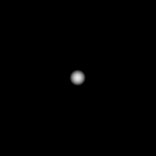

<table class='Output'>
 <tr style='vertical-align: baseline;'>
  <td style='text-align: center;'>Raw</td>
  <td style='text-align: center;'>Butterworth</td>
  <td style='text-align: center;'>Gaussian</td>
  <td style='text-align: center;'>Laplacian</td>
  <td style='text-align: center;'>USM</td>
 </tr>
 <tr style='vertical-align: baseline;'>
  <td style='text-align: center;'></td>
  <td style='text-align: center;'></td>
  <td style='text-align: center;'></td>
  <td style='text-align: center;'></td>
  <td style='text-align: center;'></td>
 </tr>
 <tr style='vertical-align: baseline;'>
  <td style='text-align: center;'></td>
  <td style='text-align: center;'></td>
  <td style='text-align: center;'></td>
  <td style='text-align: center;'></td>
  <td style='text-align: center;'></td>
 </tr>
</table>

 <a href="http://www.wolfram.com/language/" style="color:#000; text-decoration:none;">
  Created with the Wolfram Language 
 </a>

</body>

</html>
